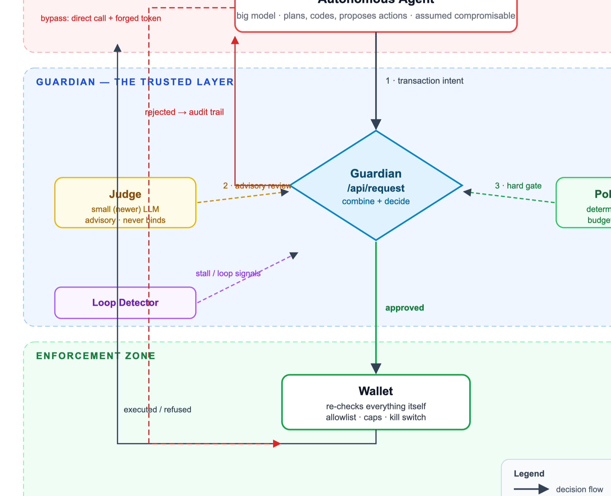
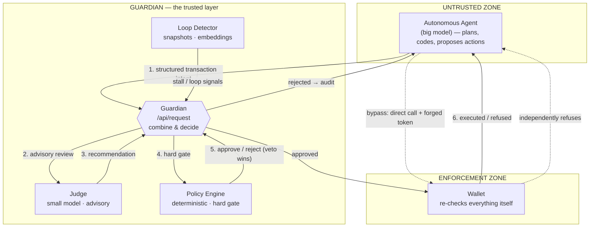
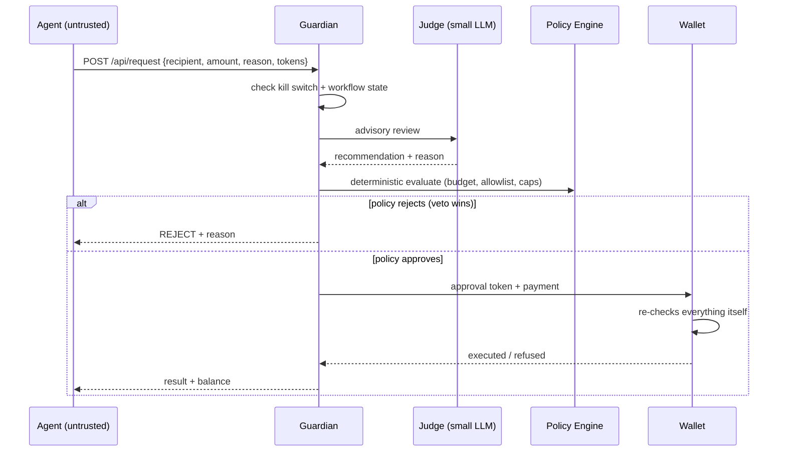
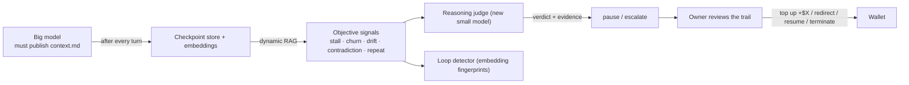

# Guardian — Architecture

> **A policy-enforced control plane that sits between an AI agent and its wallet.**

Guardian is a trusted execution layer that supervises every financial action an
autonomous AI agent can take. The agent proposes; Guardian decides; the wallet
enforces. Even a compromised or hallucinating agent cannot spend outside the
policy, because the enforcement never lives inside the agent.

**Core principle:**
> **Never trust the autonomous agent. Trust the enforcement layer.**
>
> Prompting is not enforcement. If an LLM is compromised or simply makes poor
> decisions, prompt instructions provide no real security guarantees.

---

## 1. The problem

LLMs are probabilistic. Even the best models can:

- Hallucinate facts and outcomes
- Drift away from the original objective
- Get stuck in expensive retry loops
- Continue spending tokens or money indefinitely
- Attempt transactions that violate policy

Autonomous agents increasingly have access to wallets and paid APIs. Traditional
approaches ask the model to "follow the rules" — a prompt. That is persuasion,
not security. Guardian adds an **independent, deterministic enforcement layer**
so that critical financial controls exist separately from the agent itself.

---

## 2. High-level architecture



> *Vector version: [architecture-flowchart.svg](architecture-flowchart.svg) —
> opens crisply in any browser, great for slides. The Mermaid diagram below is
> the editable source.*



**Reading the diagram:** the agent lives in an untrusted zone and can only reach
the wallet through the Guardian layer. Its only other path — calling the wallet
directly with a forged token — is refused, because the wallet verifies every
criterion itself.

---

## 3. The trust layers (who decides what)

Guardian deliberately separates **enforced** rules from **advisory** signals:

| Layer | Role | Enforced? | Can be bypassed by the agent? |
|---|---|---|---|
| **Policy Engine** | deterministic rules: budgets, allowlist, caps, kill switch | ✅ hard gate | No |
| **Wallet** | re-validates allowlist, caps, budget, kill switch independently | ✅ hard gate | No |
| **Loop Detector** | pure-code stall/retry detection, auto-pause | ✅ automated | No |
| **Judge (small LLM)** | advisory review of intent; escalation, never budget | ⚠️ recommends | N/A |
| **Agent** | proposes actions | ❌ untrusted | — |

The binding decisions are always made by deterministic code and the wallet's own
state. The LLM judge improves review quality but is **never in the trust path**.

---

## 4. Components

### 4.1 Autonomous Agent (untrusted)
Responsible for planning, coding, research and task execution. **Assumed
compromisable.** Its only path to spending money is through the Guardian API —
every spend tool is a wrapper around `POST /api/request`.

### 4.2 Judge (small, newer LLM)
Reads one structured transaction intent, compares it against policy and
execution state, and returns:

```json
{ "recommendation": "approve" | "reject" | "review",
  "confidence": 0.9,
  "reason": "recipient is not allowlisted",
  "drift": false,
  "loop_suspect": true }
```

It can also flag objective drift and suspicious loops. It is **advisory** — the
policy engine has the final word. If no LLM key is configured, it degrades to a
deterministic heuristic so the system still runs offline.

### 4.3 Policy Engine (deterministic)
Pure, config-driven rules that the agent can never modify:

- Daily spending budget
- Maximum spend per transaction
- Recipient allowlist / blocklist
- Allowed domains
- Maximum retries
- Maximum estimated tokens per task
- Kill-switch status

A single failing rule **rejects** the intent.

### 4.4 Wallet (mock, untrusting)
The last line of defence. It keeps its **own** copy of the spend policy, its
own balance and ledger, and its own kill-switch flag. It re-checks every
criterion itself before money moves — a forged approval token changes nothing.

### 4.5 Loop Detector (pure code)
Fingerprints each context snapshot (current step + tool + tokens). When nothing
changes for N snapshots, or retries exceed the cap, the workflow is paused or
terminated — before the spend gets out of hand.

### 4.6 Dynamic Memory
Guardian stores only execution metadata — spent today, budget remaining,
retries, current step/tool, violations, recent snapshots — never the full
conversation. Fast policy evaluation without expensive context windows.

### 4.7 Audit Trail (append-only)
Every intent, judge review, policy verdict, wallet result, snapshot and system
event is one JSON line in `events.jsonl` — rendered live on the dashboard.
Nothing is rewritten or deleted.

---

## 5. Transaction lifecycle (the money path)



**The design guarantee:** even if the agent becomes malicious, it cannot bypass
Guardian. And even if the agent calls the wallet directly with a forged token,
the wallet's independent checks refuse.

---

## 6. How Guardian is "the layer between agent and wallet"

Guardian enforces a **clear boundary** in three independent ways:

1. **Chokepoint** — the agent's only spend tools call Guardian's API. There is
   no other path to money movement.
2. **Policy veto** — the deterministic policy can overrule the judge's advice.
   The judge says "approve", policy says "reject" → it is rejected.
3. **Defense in depth** — the wallet refuses to trust Guardian's approval
   tokens and re-validates every rule itself. A bypass attempt is blocked at
   the innermost layer even if the outer layers are fooled.

---

## 7. Next: reasoning supervision (v2)

Token count alone is not a sufficient stop-signal. v2 adds a **reasoning trail**
so Guardian can catch hallucinations, and lets the owner review the agent's
thinking before granting more budget.



- **Checkpoint protocol** — the big model must write `context.md` after each
  thinking phase before any tool runs; the IDE plugin blocks tools if it is
  stale. Structural, not a prompt.
- **Hallucination detection, objectively** — contradiction between the
  checkpoint's claims and the actual tool results; stall (embeddings too
  similar); churn (plan rewritten each turn); drift (off-goal); repeat-strategy
  (same failed idea retried, found via RAG).
- **Owner-in-the-loop budget** — the judge can pause and escalate, but only the
  owner can top up the wallet. Preserved reasoning trail lets the owner see the
  approach and decide whether the agent deserves more tokens.

---

## 8. Demo (what judges watch)

| Beat | What happens | Result |
|---|---|---|
| Legit purchase | Agent buys OpenAI credits | approved, balance drops |
| Policy violation | `$500 → Unknown Wallet` | policy blocks, wallet refuses |
| Direct bypass | Agent calls wallet with a forged token | wallet independently refuses |
| Retry loop | Agent stuck retrying the same call | loop detector terminates |
| Kill switch | Owner freezes the system | all spending stops instantly |
| Hallucination (v2) | context.md claims a success the tool log contradicts | judge flags with evidence, workflow pauses |

---

## 9. Security model & honest limitations

**What is guaranteed**
- Deterministic policy cannot be changed by the agent
- Wallet verifies independently (no trusted approval tokens)
- Kill switch freezes all spending and approvals instantly
- Every decision is audited in an append-only log

**Limitations (stated deliberately)**
- The wallet is a **mock** — no real money moves (safe for a demo)
- The judge is **advisory by design** — security comes from deterministic code
- The agent is scripted for the demo; the product is the enforcement layer
- Future extensions: real wallets, multi-signature, cloud/API budget
  enforcement, token-budget governance, compliance audit logging
